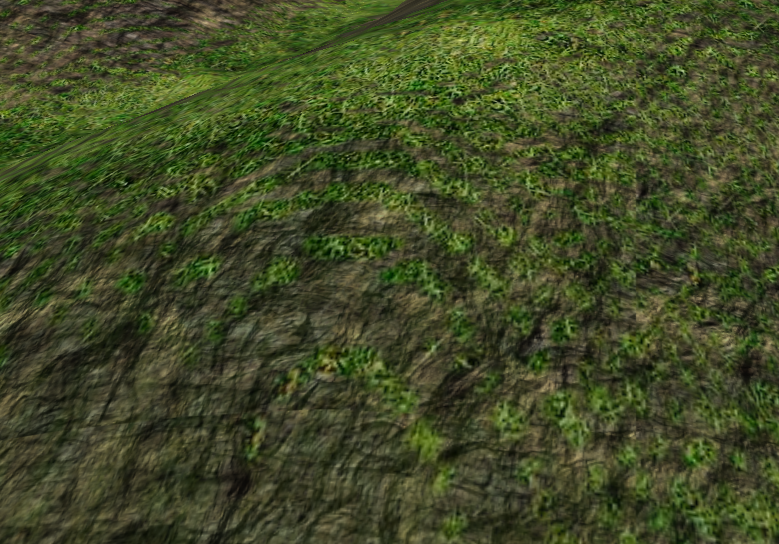
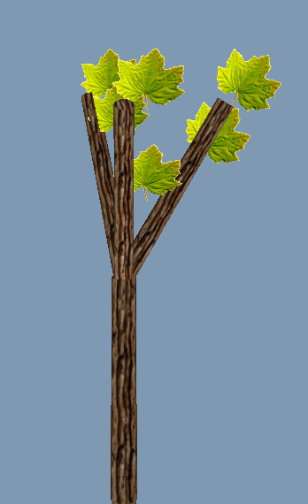
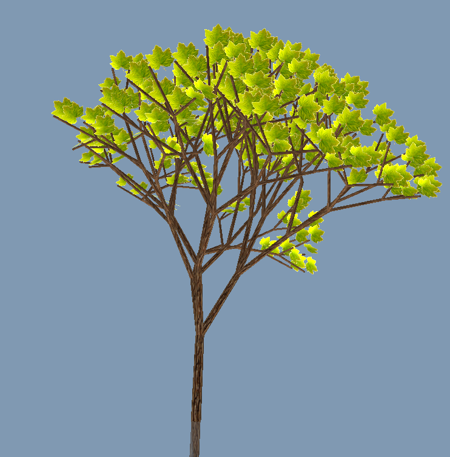
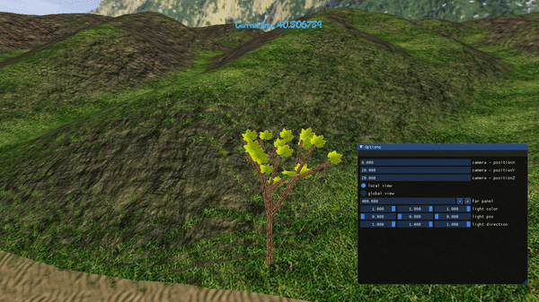
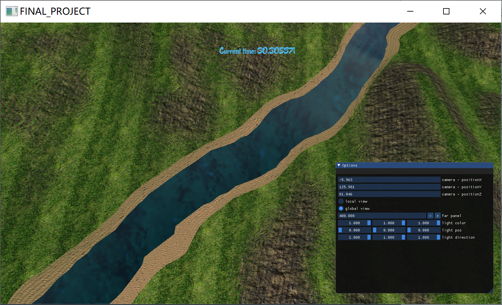

# 个人报告

| 学号     | 姓名   | 日期                |
| -------- | ------ | ------------------- |
| 16340311 | 周远笛 | 2019.6.14-2019.7.19 |

# Basic

## Camera Roaming

### 简介

最开始默认使用局部视角，点击GUI中global的选项可以切换为全局视角。这个效果使得用户可以根据需要选择关注当前眼前的一棵树和整体的大布景。

### 实现

> 采用在Camera类里存储两份摄像机的x,y,z坐标位置和Yaw, Pitch角度

初始化时，给出默认的全局和局部视角；从局部视角切换为全局视角的过程中先使用局部视角讲当前摄像机的位置和角度参数保存，再将摄像机相关参数赋值为全局视角对应的相关参数；从全局视角切换为局部视角的过程亦如此，也是先将当前摄相机参数存储到局部视角后，才用上一次切换存储下来的局部视角替换当前摄像机位置。

这样做的好处在于，每次用户在一个模式下修改视角的相关参数，当切换到另一个摄像机视角再切换回来的时候，能够根据上次离开时的参数信息继续操作，而不是每一次都是在局部/全局视角的默认值中重新调整摄像机位置。

代码如下：

```cpp
// 切换为全局
if (mode == 0) {
    // 将当前的状态保存
    localPosition = Position;
    Position = globalPosition;
    localYaw = Yaw;
    localPitch = Pitch;
    Yaw = globalYaw;
    Pitch = globalPitch;
}
// 切换为局部
else {
    // 将当前的状态保存
    if (first) {
        Position = localPosition;
        first = false;

    }
    else {
        globalPosition = Position;
        Position = localPosition;

        globalYaw = Yaw;
        globalPitch = Pitch;
        Yaw = localYaw;
        Pitch = localPitch;
    }
}
updateCameraVectors();
```

### 效果

点击GUI界面中global和local选项，可以在局部和全局视角之间切换。


## Simple Lighting and Shading

### 简介

这里由于树和水的计算量较大，我们采用了Phong和Blinn Phong的简单光照模型，对于光源有单独的控制，场景中的非光源但接受光照的物体获得光源类的实例的相关参数实现光照效果。

### 实现

#### 水

由于实现的是动态的水波，因此使用的是`Blinn Phong`的光照模型使得运行时不会那么卡顿。`blinn`可以通过参数传入。

```cpp
float ambientStrength = 0.7;
vec3 ambient = ambientStrength * lightColor;

vec3 norm = normalize(Normal);
vec3 lightDir = normalize(lightPos - FragPos);
float diff = max(dot(norm, lightDir), 0.1);
vec3 diffuse = diff * lightColor;

float specularStrength = 1.0;
vec3 viewDir = normalize(eyePos - FragPos);
float spec = 0.0;
if (blinn)
{
    vec3 halfwayDir = normalize(lightDir + viewDir);
    pow(max(dot(norm, halfwayDir), 0.1), 128);
}
else
{
    vec3 reflectDir = reflect(-lightDir, norm);
    spec = pow(max(dot(viewDir, reflectDir), 0.1), 32);
}
vec3 specular = specularStrength * spec * lightColor;

float ratio = 1.0 / 1.33;
float fresnel = dot(viewDir, norm);
vec3 refSkyDir = reflect(-viewDir, norm);
vec3 fracSkyDir = refract(-viewDir, norm, ratio);
vec4 refracColor = fresnel * texture(skybox, fracSkyDir) * vec4(gridColor, 1.0);
vec4 reflecColor = (1.0 - fresnel) * texture(skybox, refSkyDir);

vec3 result = (ambient + diffuse + specular) * gridColor;
//color = vec4(result, 1);
color = vec4(ambient + diffuse + specular, 1.0) * (reflecColor + refracColor);
```

#### 地形

```cpp
color = (ambient + diffuse + specular)*mapped;
```

> mapped为地形根据纹理渲染出来的效果。

## Texture Mapping

### 简介

这里的纹理映射处处都有使用，包括树干的贴图和树叶的贴图以及透明度的设置、地形的变化甚至过度地段以及天空盒。

这部分主要介绍树叶贴图中透明度和设置和地形贴图中不同地形的融合。

### 实现

所有的贴图都是使用glTexture函数进行绑定...，核心代码如下：

```cpp
static GLuint loadTexture(GLchar* path) {
    // Generate texture ID and load texture data 
    GLuint textureID;
    glGenTextures(1, &textureID);
    glBindTexture(GL_TEXTURE_2D, textureID);
    // Parameters
    glTexParameteri(GL_TEXTURE_2D, GL_TEXTURE_WRAP_S, GL_REPEAT);
    glTexParameteri(GL_TEXTURE_2D, GL_TEXTURE_WRAP_T, GL_REPEAT);
    glTexParameteri(GL_TEXTURE_2D, GL_TEXTURE_MIN_FILTER, GL_LINEAR_MIPMAP_LINEAR);
    glTexParameteri(GL_TEXTURE_2D, GL_TEXTURE_MAG_FILTER, GL_LINEAR);

    int width, height, n;
    //stbi_set_flip_vertically_on_load(true);
    unsigned char *image = stbi_load(path, &width, &height, &n, 0);// Assign texture to ID
    if (image) {
        glTexImage2D(GL_TEXTURE_2D, 0, GL_RGB, width, height, 0, GL_RGB, GL_UNSIGNED_BYTE, image);
        printf("%d, %d, %d\n", width, height, n);
        glGenerateMipmap(GL_TEXTURE_2D);
    }
    else {
        cout << "fail to load texture in " << path << endl;
    }
    stbi_image_free(image);
    glBindTexture(GL_TEXTURE_2D, 0);
    return textureID;
}
```

#### 树叶的透明

这一部分实现的关键在于读取纹理图像的时候需要读取透明度的通道，因此读取树叶纹理的时候使用了单独的代码。

```cpp
/*
 * the white part of the texture will be transparent
 */
static GLuint loadTextureCutout(GLchar* path) {
    // Generate texture ID and load texture data 
    GLuint textureID;
    glGenTextures(1, &textureID);
    glBindTexture(GL_TEXTURE_2D, textureID);
    // Parameters
    glTexParameteri(GL_TEXTURE_2D, GL_TEXTURE_WRAP_S, GL_REPEAT);
    glTexParameteri(GL_TEXTURE_2D, GL_TEXTURE_WRAP_T, GL_REPEAT);
    glTexParameteri(GL_TEXTURE_2D, GL_TEXTURE_MIN_FILTER, GL_LINEAR_MIPMAP_LINEAR);
    glTexParameteri(GL_TEXTURE_2D, GL_TEXTURE_MAG_FILTER, GL_LINEAR);

    int width, height, n;
    //stbi_set_flip_vertically_on_load(true);
    unsigned char *image = stbi_load(path, &width, &height, &n, STBI_rgb_alpha);// Assign texture to ID
    if (image) {
        glTexImage2D(GL_TEXTURE_2D, 0, GL_RGBA, width, height, 0, GL_RGBA, GL_UNSIGNED_BYTE, image);
        printf("%d, %d, %d\n", width, height, n);
        glGenerateMipmap(GL_TEXTURE_2D);
    }
    else {
        cout << "fail to load texture in cutout" << endl;
    }
    stbi_image_free(image);
    return textureID;
}
```

#### 地形的融合

为了使得整个场景更为自然，采用了不同高度的地形采用不同贴图的方法：

1. 首先需要对于每个海拔贴的纹理进行人为规定

   比如在我的实现中，是一个从河边沙地过渡到林地的过程

2. 将过度地带的纹理进行混合

   使用shader中的mix将两种纹理混合贴图：

   ```cpp
   if(displaced.z < stoneMin) {
       vec3 stone = texture2D(stoneTex, 10*displaced.xy).rgb;
       vec3 sand = texture2D(sandTex, 30*displaced.xy).rgb;
       mapped = mix(stone, sand, slope);    
   ```

3. 加入地形坡度的影响使得贴图更自然

   ```cpp
   float slope = smoothstep(0.35, 0.65 , normal.z);
   ```

### 效果

树的普通贴图效果见下文树的实现效果，这里先放地形中纹理融合的效果：



## Model Import & Mesh viewing

### 简介

我在进行流动的水的实现时引入了Mesh的obj文件。由于读入的mesh就是一个切割成三角面片的平面，因此读取较为简单，法向量都是一样的（具体水面的波动是在vs中计算的）

### 实现

```cpp
if (line[0] == 'v')
{
    if (line[1] == 'n')
    {
        if (sscanf(line.c_str(), "vn%f%f%f", &x, &y, &z) == 3)
            vn.push_back(glm::vec3(x, y, z));
        else throw std::runtime_error("Vertex normal format unsupported!");
    }
    else if (line[1] == 't')
    {
        if (sscanf(line.c_str(), "vt%f%f", &x, &y) == 2)
            vt.push_back(glm::vec2(x, y));
        else throw std::runtime_error("UV coordinate format unsupported!");
    }
    else
    {
        if (sscanf(line.c_str(), "v%f%f%f", &x, &y, &z) == 3)
            v.push_back(glm::vec3(x, y, z));
        else throw std::runtime_error("Vertex position format unsupported!");
    }
}
else if (line[0] == 'f')
{
    // A face is composed of triangles
    // Note that we don't need to convert to 0-based indexing since we pushed those
    // zeros at the begining of this function
    // VertexFormat stores the attributes in the following order: v/vn/vt

    Triplet t(0);
    std::istringstream ss(&line[1]);
    std::string tok;
    GLuint firstVertexOfFace = -1, previousVertex = -1;
    for (GLint k = 0; (ss >> tok); ++k)
    {
        if (sscanf(tok.c_str(), "%d/%d/%d", &t.x, &t.y, &t.z) == 3);
        else if (sscanf(tok.c_str(), "%d//%d", &t.x, &t.z) == 2);
        else if (sscanf(tok.c_str(), "%d/%d", &t.x, &t.y) == 2);
        else if ((sscanf(tok.c_str(), "%d", &t.x) == 1));
        else throw std::runtime_error("Face format unsupported!");

        // Correction for negative indices
        if (t.x < 0) t.x = v.size() + t.x;
        if (t.y < 0) t.y = vt.size() + t.y;
        if (t.z < 0) t.z = vn.size() + t.z;

        if (vindex.find(t) == vindex.end())
        {
            vindex[t] = vertices.size();
            vertices.push_back(VertexFormat(v[t.x].x, v[t.x].y, v[t.x].z,
                                            vn[t.z].x, vn[t.z].y, vn[t.z].z,
                                            vt[t.y].x, vt[t.y].y));
        }

        if (k < 3)
        {
            if (k == 1) firstVertexOfFace = vindex[t];
            indices.push_back(vindex[t]);
        }
        else
        {
            indices.push_back(firstVertexOfFace);
            indices.push_back(previousVertex);
            indices.push_back(vindex[t]);
        }

        previousVertex = vindex[t];
    }
}
```

# Bonus

## Skybox

### 简介

天空盒的精髓在于两点：1. 找到美丽的图片 2. 平移过程中最后一列为0（期中考试题有所提及）

### 实现

技术上的实现主要就是其相对摄像机的位置不随着摄像机的移动而改变。

天空盒的实现主要输一个cubemap贴图的技术点。这一步需要绑定纹理类型`GL_TEXTURE_CUBE_MAP`，每一个面的纹理都需要`glTexImage2D`函数，OpenGL的六个不同纹理目标对应了立方体六个不同的面。这里由于每个纹理目标相对上一个是连续递增的枚举值，因此可以按照右、左、上、下、后、前的顺序依次绑定六个面的贴图。

在现实天空盒的时候需要注意以下几点：

1. 关闭深度写入`glDepthMask(GL_FALSE);`

2. 天空盒是不随玩家移动改变的，因此移除视图矩阵的平移部分：

   ```
   glm::mat4 view = glm::mat4(glm::mat3(camera.GetViewMatrix()));
   ```

### 效果


## Fluid Simulation

### 简介

流体模拟在我们的项目中主要通过水的实现来体现。

其中mesh的导入在model import的部分已经写过了，水的流动主要是通过Gerstner Waves波动的物理模型实现的。

关于波浪的实现，采用的方法是对于三角面片上的每个顶点在不同时刻计算出其坐标（这一步在vs中实现），再传入fs进行渲染。

这一过程遵循以下公式：
$$
P(x,y,t) = \\\left(x+\sum\left(Q_iA_i\times D_i.x\times \cos(w_iD_i\bullet(x,y)+\phi_it\right),\\
y+\sum\left(Q_iA_i\times D_i.y\times \cos(w_iD_i\bullet(x,y)+\phi_it\right),\\
\sum\left(A_i\sin(w_iD_i\bullet(x,y)+\phi_it\right)\right)
$$

### 实现

水的波动实际上是顶点的变化，这里是通过定点渲染器根据时间随着上面的公式改变坐标位置实现的，main函数如下，其中引用的computePosX, Y, Z遵循上面的公式，法向量直接使用的法向量计算公式：

```cpp
Normal = normal;
// Compute direction for circular wave
w[1].D = -normalize(position.xz - w[1].C);
w[2].D = -normalize(position.xz - w[2].C);
computeDamping();

/** Using Grestner Waves **/
// Compute new position
Position.x += computePosX();
Position.z += computePosZ();
Position.y += computePosY();
// Compute new normals
Normal.x = computeNormX();
Normal.z = computeNormZ();
Normal.y = computeNormY();

vec4 worldPos = model * vec4(Position, 1);  
gl_Position = projection * view * worldPos;
FragPos = worldPos.xyz;
```

### 效果


## LSystem

### 简介

Lsystem用于树木生长的模拟。首先需要定义树生长的文法，根据文法进行每个树枝始末坐标的计算以及树叶位置坐标的计算。每个树枝和树叶根据自己的方向计算平移旋转的量；这样一步步根据文法将通过旋转到正确角度、平移到正确位置的树枝和树叶拼接在一起，就得到了一棵树。树的生长是根据文法的进一步迭代和树枝树叶数组加入新的对象实现的。

### 实现

#### 规定文法

首先有一个**基础结构**（树苗），对其进行迭代得到最后的文法字符串。

> `FA[*+X][-/&X][/%X]B`
>
> 

##### 迭代

遍历字符串，遇到`X`则有一定概率加入一个**基础结构**。因此进行多次迭代后会有较长的文法字符串，如下：

> `FA[*+FA[*+X][-/&X][/%X]B][-/&FA[*+X][-/&X][/%X]B][/%FA[*+X][-/&X][/%X]B]B`

代码如下：

```cpp
if (rule == "") {
    rule = grammar;
}
string temprule = rule;
rule = "";
for (int i = 1; i <= level; i++) {
    // for each level
    int curlen = temprule.length();
    int j = 0;
    while (j < curlen) {
        if (temprule[j] == 'X')// root
        {
            double x = rand() % 100; ;
            if (x > 20) {
                rule += grammar; // add a new branch 
            }
            j++;
        }
        else // rotate
        {
            rule += temprule[j]; // continue reading the grammar
            j++;
        }
    }
    temprule = rule;
    rule.clear();
}
rule = temprule;
```


#### 解析文法并绘制树

##### 解析文法

- `F` - 添加树枝，当前位置为起点，根据旋转角度和树枝长度计算出终点位置

- `X` - 添加末端枝条，即树枝上带有叶片

- `A` - 【树枝变细】树枝的长度和半径按照一定比例缩小

- `B` - 【树枝变粗】在一个树枝绘制完毕回溯时使用

- `[` - 标识树枝开始

- `]` - 标识树枝结束

  > 整体使用一个栈保存每个结点的位置，每当新建一个树枝的时候新节点入栈，每当结束一个树枝的时候栈顶弹出。

- `+` - 绕x轴旋转正角度

- `-` - 绕x轴旋转负角度

- `*` - 绕y轴旋转正角度

- `/` - 绕y轴旋转负角度

- `&` - 绕z轴旋转正角度

- `%` - 绕z轴旋转负角度

代码如下：

```cpp
case 'F': // add a branch
tmp_trunk.pos1 = curState.pos; // start point
curState.pos = curState.pos + (GLfloat)length * curState.dir; 
tmp_trunk.pos2 = curState.pos;// end point 
tmp_trunk.radius = radius;
trunks.push_back(tmp_trunk);
break;
case 'X': // add a branch with leaf
// start points
tmp_leaf.pos1 = curState.pos;
tmp_trunk.pos1 = curState.pos;
curState.pos = curState.pos + (GLfloat)length * curState.dir; 
// end points
tmp_trunk.pos2 = curState.pos;
tmp_leaf.pos1 += (tmp_trunk.pos2 - tmp_trunk.pos1) * (GLfloat)((double)(rand() % 9) / 10);
tmp_leaf.pos2 = curState.pos;
// radius
tmp_trunk.radius = radius;
tmp_leaf.radius = leafRadius;
// add to vector
trunks.push_back(tmp_trunk);
leaves.push_back(tmp_leaf);
tmp_leaf.pos2 = curState.pos + (tmp_trunk.pos2 - tmp_trunk.pos1);
tmp_leaf.pos1 = curState.pos;
leaves.push_back(tmp_leaf);
break;
case 'A':
// with the growth, both length and radius of the branch decrease
length = length * lengthFactor;
radius = radius * radiusFactor;
break;
case 'B':
// backtrack: both length and radius of the branch increase
length = length / lengthFactor;
radius = radius / radiusFactor;
break;
case '[': // start a new branch 
stack[stackpointer] = curState;
stackpointer++;;
break;
case ']': // end of the new branch and back to its parent branch
curState = stack[stackpointer - 1];
stackpointer--;
break;
case '+': // rotate to x
T = glm::rotate(glm::mat4(1.0f), (float)dx, xAxis);
curState.dir = T * curState.dir;
break;
case '-': 
T = glm::rotate(glm::mat4(1.0f), (float)-dx, xAxis);
curState.dir = T * curState.dir;
break;
case '*': // rotate to y
T = glm::rotate(glm::mat4(1.0f), (float)dy, yAxis);
curState.dir = T * curState.dir;
break;
case '/':
T = glm::rotate(glm::mat4(1.0f), (float)-dy, yAxis);
curState.dir = T * curState.dir;
break;
case '&': // rotate to z
T = glm::rotate(glm::mat4(1.0f), (float)dz, zAxis);
curState.dir = T * curState.dir;
break;
case '%':
T = glm::rotate(glm::mat4(1.0f), (float)-dz, zAxis);
curState.dir = T * (curState.dir);
break;
default:
;
```

##### 树枝

首先计算出单个圆柱体的控制顶点，并贴图构成树干。根据文法获得每一根树枝的起点和终点，并存入顶点数组。这样后期绘制圆柱体的步骤分为四步：

1. 绘制基础圆柱体：起点为原点，终点在y轴上
2. 计算缩放矩阵：根据起点终点距离获得树枝长度，根据解析文法时的存入的半径进行树枝粗细的缩放
3. 计算旋转矩阵：计算当前圆向量（竖直向上）与目标向量（从树枝的起点到终点）的叉积；标准化后点乘获得二者的夹角 => 得到旋转轴和旋转角即可用`rotate`函数获得旋转矩阵
4. 计算平移矩阵：平移到树枝起点位置

```cpp
glm::vec3 delta = glm::vec3(end.x - start.x, end.y - start.y, end.z - start.z);
GLfloat distance = sqrt(pow(delta.x, 2) + pow(delta.y, 2) + pow(delta.z, 2));
glm::mat4 translation = glm::translate(glm::mat4(1.0f), glm::vec3(start.x, start.y, start.z));
if (delta.x == 0 && delta.z == 0) {
    drawCylinder(translation* glm::scale(glm::mat4(1.0f), glm::vec3(radius, (GLfloat)distance, radius)));
}
else {
    glm::vec3 assVec = glm::vec3(0, distance, 0);
    glm::vec3 normal = glm::cross(assVec, delta);
    GLfloat angle = acos(glm::dot(assVec, delta) / distance / distance);
    glm::mat4 rotation = glm::rotate(glm::mat4(1.0f), angle, normal);
    glm::mat4 model = rotation * glm::scale(glm::mat4(1.0f), glm::vec3(radius, (GLfloat)distance, radius));
    drawCylinder(translation* model);
}
```

##### 树叶

计算出树叶的起点和终点坐标，在方形平面上贴图，根据树叶起点和终点的位置进行相应平移旋转变换即可得到树叶的坐标。

总体的缩放、平移、旋转和树枝相似，且树叶没有长度只有半径，而且半径为常量。

#### 树的生长

我们希望的是通过鼠标在屏幕上停留一段时间不移动作为树生长的条件。因此在main中计算鼠标上一次移动所经过的时间，并传入树的display()函数，在while循环中不断进行判断：

```cpp
if (interval > GROWINTERVAL) { // interval为main中的stopStartTime
    grow();
    stopStartTime = glfwGetTime();
}
```

在处理鼠标移动的回调函数中进行判断：

```cpp
// 更新停止移动鼠标开始的时间
stopStartTime = glfwGetTime();
```

### 效果

#### 静态绘制



#### 动态生长



## Terrain

实在想不到terrain可以归属到Basic和Bonus的哪一个模块，干脆就放到最底下单独说一下。（个人认为可以拆分到texture和model import中，当然是一种从heightmap图像中引入model的特殊方式）。

### 简介

这里的地形是根据一副平面的地形贴图得到的，根据灰度贴图的r通道数值决定地形的高低。为了使得地形实现得更加逼真，在不同的高度采用不同的贴图，比如最底下是沙地（sand），虽然在渲染的时候被水遮挡了；向上是草地和沙地的结合；之后是草地和石头的结合。并且根据坡度的变化调节二者再结合过程中的占比。

原理如下：

1. 生成三角形网格
2. 将三角形网格和图片上的点形成对应关系（即把纹理贴在三角形网格上）
3. 将纹理的r通道值作为顶点的高度（这一步在vs中实现）

经过以上步骤，我们就获得了一个由三角形网格构成的有高低变化的地形。

### 实现

将贴图传入顶点着色器之后，使用以下语句，读取贴图对应位置的r通道颜色值：

```cpp
float height = texture(heightMapTex, UV).r;
```

### 效果



