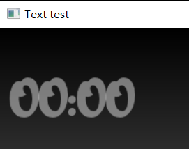
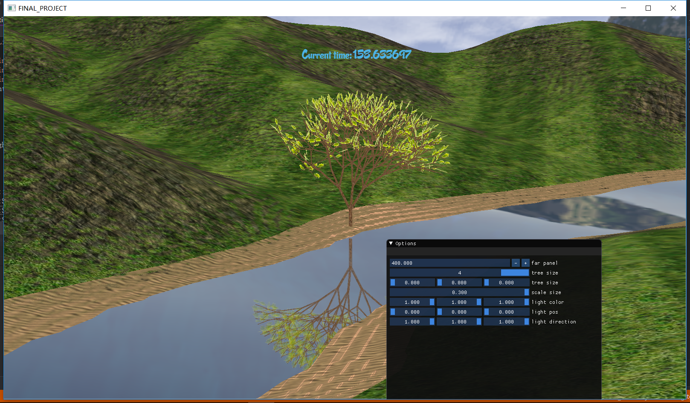
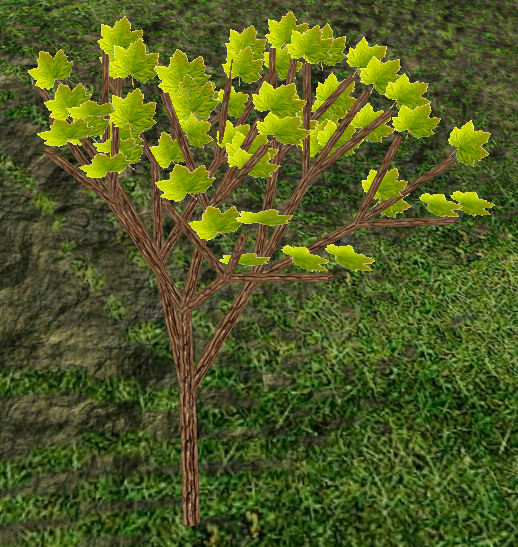
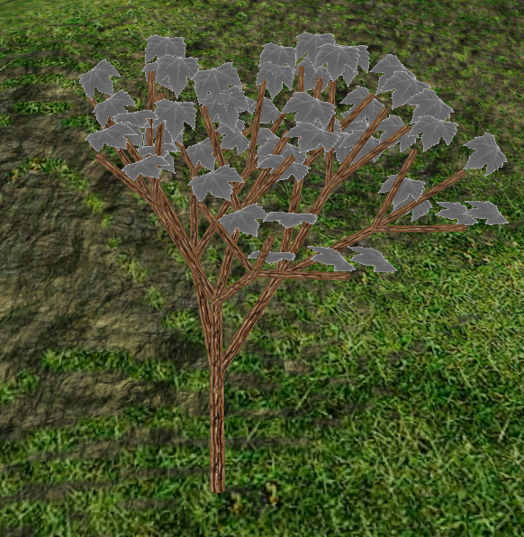
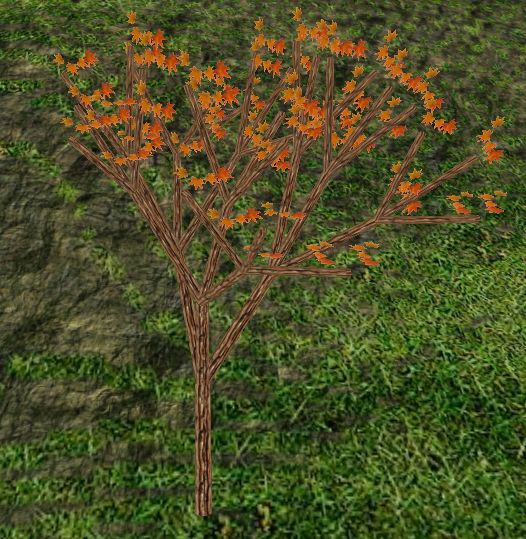
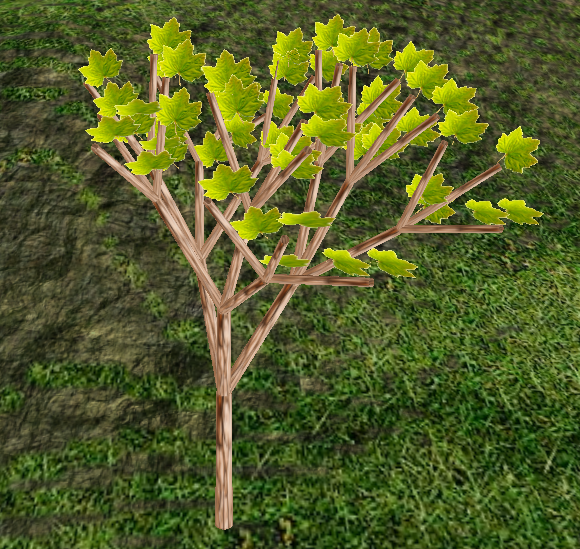
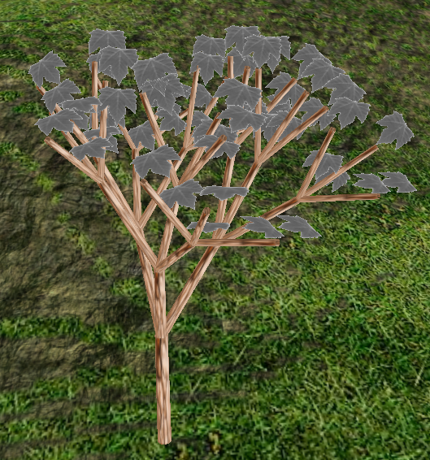
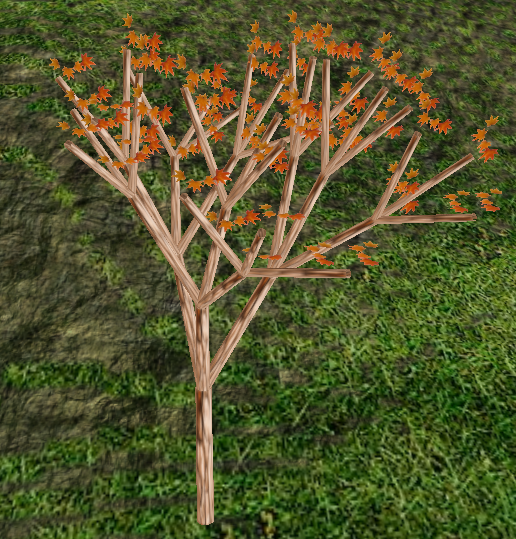

| 课程名称 | 计算机图形学 | 任课老师 | 高成英 |
| :------------: | :-------------: | :------------: | :-------------: |
| 年级 | 16级 | 专业（方向） | 软件工程（数字媒体）|
| 学号 | 16340255 | 姓名 | 谢涛 |
| 电话 | 13670828568 | Email | 1176748429@qq.com |

## 个人报告

#### 显示字体

一开始打算在 GitHub 上找一些比较好看的字体库来使用，找了一段时间找到过两个好一些的库，一个是渲染 3d 字体，一个是渲染 2d 字体，经测试后发现该 3d字体库 用的依赖较老且存在一些内部问题，该 2d字体库 则与项目不兼容，便决定老老实实跟着 freetype 的教程自己渲染 2d 的字体，花了些时间去找一些比较漂亮的2d字体。

- 测试阶段。  
配置过程主要是要解决依赖问题，花了点时间，此效果为已通过测试，但尚未加入项目中。

- 实现阶段。实现目标：在场景中显示时间戳，植物的生长状态会根据时间变化（比如每过十五分钟或半个小时，树长大一点）。

#### 遇到的问题
按着教程实现字体的渲染还算简单，如测试阶段，但在实现阶段遇到了一些问题，主要是在项目中整合测试阶段所用的渲染字体代码时，导致场景其他物体显示不正常，比如树的叶子有些显示出来有些显示不出来，整个terrain不见了。

这个问题原因找了很久，后来发现是树的叶子显示不全是设置了 glEnable(GL_CULL_FACE) 导致被剔除了一部分；整个terrain消失则是因为变透明了，在与字体混合时，字体的渲染需要 glEnable(GL_BLEND)，而一同使用的 glBlendFunc(GL_SRC_ALPHA, GL_ONE_MINUS_SRC_ALPHA) 则定义了 alpha 通道的混合模式，glBlendFunc() 可以用来解决纹理混合以及显示半透明纹理的需求。最后那个 GL_ONE_MINUS_SRC_ALPHA 有对字体的前景背景对调方便字体显示，导致了 terrain 变透明。解决方案就是等字体渲染完之后 glDisable(GL_BLEND)。

#### 切换纹理

#### 协助测试其他模块
建立测试分支，尝试合并及处理冲突，其他终端运行测试。
