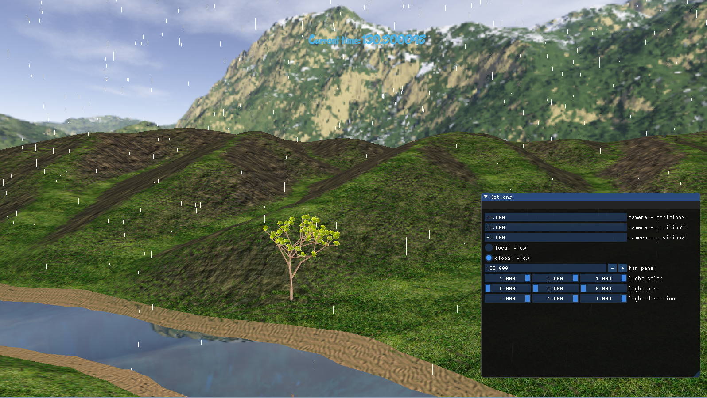

| 课程名称 | 计算机图形学 | 任课老师 | 高成英 |
| :------------: | :-------------: | :------------: | :-------------: |
| 年级 | 16级 | 专业（方向） | 软件工程（数字媒体）|
| 学号 | 16340269 | 姓名 | 杨泓臻 |

## 个人报告
#### 实现内容
通过粒子系统实现下雨的效果

#### 参考
参考learnopengl的粒子教程来进行编写，但是因为范例是二维的，并且生成的粒子效果不同，所以对于顶点着色器和代码的编写还是有比较多的改动，并且加入了自己的思考

#### 粒子系统实现
每一滴雨都是一个粒子，通过粒子生成器particleGenerator来对粒子进行统一的管理，持续不断地生成新的粒子，以及将过期的粒子进行回收，避免内存的过度占用。

一般的粒子有一个生存周期life值，但是因为雨受重力控制，生存周期是从产生到落地，所以根据粒子位置的y值来判断粒子是否处于存活状态。

关于粒子用什么形状，本来有考虑过用贴图水滴的图片，但是因为雨的下落速度较快，正常观察到的不是水珠而是类似线端，所以以线段来作为粒子的显示形状。

如何控制雨量的大小，通过控制粒子的下落速度和每次更新增加的粒子数量来实现。

#### 效果截图
