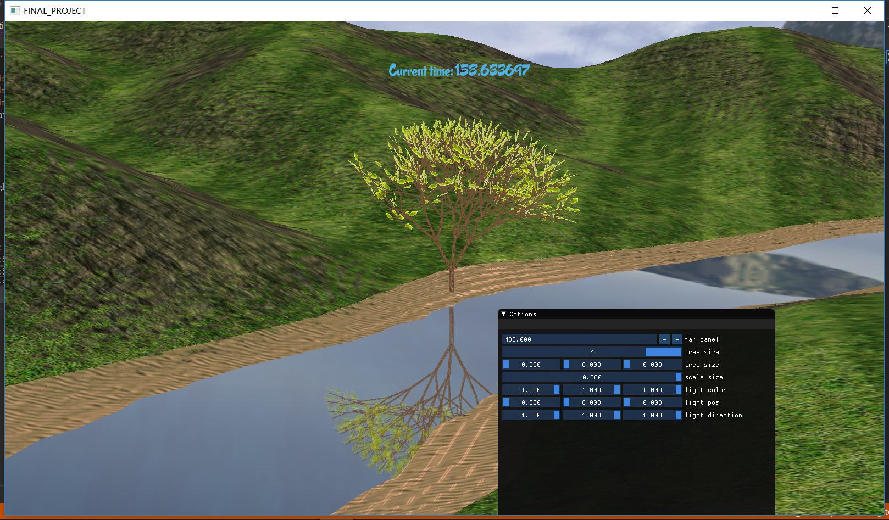

# 小组Report

| 组号 | 组员                         |
| ---- | ---------------------------- |
| 2    | 周远笛、谢涛、袁之浩、杨泓臻 |

## 项目介绍以及实现结果（周远笛）

## 开发环境以及使用到的第三方库（谢涛）


环境：opengl基础环境，无特殊dll。

第三方lib如下。

```
opengl_libs
├─include
│  │  ft2build.h
│  │  stb_image.h
│  │
│  ├─freetype
│  │  │  freetype.h
│  │  │  ftadvanc.h
│  │  │  ftautoh.h
│  │  │  ftbbox.h
│  │  │  ftbdf.h
│  │  │  ftbitmap.h
│  │  │  ftbzip2.h
│  │  │  ftcache.h
│  │  │  ftcffdrv.h
│  │  │  ftchapters.h
│  │  │  ftcid.h
│  │  │  fterrdef.h
│  │  │  fterrors.h
│  │  │  ftfntfmt.h
│  │  │  ftgasp.h
│  │  │  ftglyph.h
│  │  │  ftgxval.h
│  │  │  ftgzip.h
│  │  │  ftimage.h
│  │  │  ftincrem.h
│  │  │  ftlcdfil.h
│  │  │  ftlist.h
│  │  │  ftlzw.h
│  │  │  ftmac.h
│  │  │  ftmm.h
│  │  │  ftmodapi.h
│  │  │  ftmoderr.h
│  │  │  ftotval.h
│  │  │  ftoutln.h
│  │  │  ftpfr.h
│  │  │  ftrender.h
│  │  │  ftsizes.h
│  │  │  ftsnames.h
│  │  │  ftstroke.h
│  │  │  ftsynth.h
│  │  │  ftsystem.h
│  │  │  fttrigon.h
│  │  │  ftttdrv.h
│  │  │  fttypes.h
│  │  │  ftwinfnt.h
│  │  │  t1tables.h
│  │  │  ttnameid.h
│  │  │  tttables.h
│  │  │  tttags.h
│  │  │  ttunpat.h
│  │  │
│  │  ├─config
│  │  │      ftconfig.h
│  │  │      ftheader.h
│  │  │      ftmodule.h
│  │  │      ftoption.h
│  │  │      ftstdlib.h
│  │  │
│  │  └─internal
│  │      │  autohint.h
│  │      │  ftcalc.h
│  │      │  ftdebug.h
│  │      │  ftdriver.h
│  │      │  ftgloadr.h
│  │      │  fthash.h
│  │      │  ftmemory.h
│  │      │  ftobjs.h
│  │      │  ftpic.h
│  │      │  ftrfork.h
│  │      │  ftserv.h
│  │      │  ftstream.h
│  │      │  fttrace.h
│  │      │  ftvalid.h
│  │      │  internal.h
│  │      │  psaux.h
│  │      │  pshints.h
│  │      │  sfnt.h
│  │      │  t1types.h
│  │      │  tttypes.h
│  │      │
│  │      └─services
│  │              svbdf.h
│  │              svcid.h
│  │              svfntfmt.h
│  │              svgldict.h
│  │              svgxval.h
│  │              svkern.h
│  │              svmm.h
│  │              svotval.h
│  │              svpfr.h
│  │              svpostnm.h
│  │              svprop.h
│  │              svpscmap.h
│  │              svpsinfo.h
│  │              svsfnt.h
│  │              svttcmap.h
│  │              svtteng.h
│  │              svttglyf.h
│  │              svwinfnt.h
│  │
│  ├─GL
│  │      eglew.h
│  │      freeglut.h
│  │      freeglut_ext.h
│  │      freeglut_std.h
│  │      glew.h
│  │      glut.h
│  │      glxew.h
│  │      wglew.h
│  │
│  ├─glad
│  │      glad.h
│  │
│  ├─GLFW
│  │      glfw3.h
│  │      glfw3native.h
│  │
│  ├─glm
│  │  │  CMakeLists.txt
│  │  │  common.hpp
│  │  │  exponential.hpp
│  │  │  ext.hpp
│  │  │  fwd.hpp
│  │  │  geometric.hpp
│  │  │  glm.hpp
│  │  │  integer.hpp
│  │  │  mat2x2.hpp
│  │  │  mat2x3.hpp
│  │  │  mat2x4.hpp
│  │  │  mat3x2.hpp
│  │  │  mat3x3.hpp
│  │  │  mat3x4.hpp
│  │  │  mat4x2.hpp
│  │  │  mat4x3.hpp
│  │  │  mat4x4.hpp
│  │  │  matrix.hpp
│  │  │  packing.hpp
│  │  │  trigonometric.hpp
│  │  │  vec2.hpp
│  │  │  vec3.hpp
│  │  │  vec4.hpp
│  │  │  vector_relational.hpp
│  │  │
│  │  ├─detail
│  │  │      compute_common.hpp
│  │  │      compute_vector_relational.hpp
│  │  │      func_common.inl
│  │  │      func_common_simd.inl
│  │  │      func_exponential.inl
│  │  │      func_exponential_simd.inl
│  │  │      func_geometric.inl
│  │  │      func_geometric_simd.inl
│  │  │      func_integer.inl
│  │  │      func_integer_simd.inl
│  │  │      func_matrix.inl
│  │  │      func_matrix_simd.inl
│  │  │      func_packing.inl
│  │  │      func_packing_simd.inl
│  │  │      func_trigonometric.inl
│  │  │      func_trigonometric_simd.inl
│  │  │      func_vector_relational.inl
│  │  │      func_vector_relational_simd.inl
│  │  │      glm.cpp
│  │  │      qualifier.hpp
│  │  │      setup.hpp
│  │  │      type_float.hpp
│  │  │      type_half.hpp
│  │  │      type_half.inl
│  │  │      type_mat2x2.hpp
│  │  │      type_mat2x2.inl
│  │  │      type_mat2x3.hpp
│  │  │      type_mat2x3.inl
│  │  │      type_mat2x4.hpp
│  │  │      type_mat2x4.inl
│  │  │      type_mat3x2.hpp
│  │  │      type_mat3x2.inl
│  │  │      type_mat3x3.hpp
│  │  │      type_mat3x3.inl
│  │  │      type_mat3x4.hpp
│  │  │      type_mat3x4.inl
│  │  │      type_mat4x2.hpp
│  │  │      type_mat4x2.inl
│  │  │      type_mat4x3.hpp
│  │  │      type_mat4x3.inl
│  │  │      type_mat4x4.hpp
│  │  │      type_mat4x4.inl
│  │  │      type_mat4x4_simd.inl
│  │  │      type_quat.hpp
│  │  │      type_quat.inl
│  │  │      type_quat_simd.inl
│  │  │      type_vec1.hpp
│  │  │      type_vec1.inl
│  │  │      type_vec2.hpp
│  │  │      type_vec2.inl
│  │  │      type_vec3.hpp
│  │  │      type_vec3.inl
│  │  │      type_vec4.hpp
│  │  │      type_vec4.inl
│  │  │      type_vec4_simd.inl
│  │  │      _features.hpp
│  │  │      _fixes.hpp
│  │  │      _noise.hpp
│  │  │      _swizzle.hpp
│  │  │      _swizzle_func.hpp
│  │  │      _vectorize.hpp
│  │  │
│  │  ├─ext
│  │  │      matrix_clip_space.hpp
│  │  │      matrix_clip_space.inl
│  │  │      matrix_common.hpp
│  │  │      matrix_common.inl
│  │  │      matrix_double2x2.hpp
│  │  │      matrix_double2x2_precision.hpp
│  │  │      matrix_double2x3.hpp
│  │  │      matrix_double2x3_precision.hpp
│  │  │      matrix_double2x4.hpp
│  │  │      matrix_double2x4_precision.hpp
│  │  │      matrix_double3x2.hpp
│  │  │      matrix_double3x2_precision.hpp
│  │  │      matrix_double3x3.hpp
│  │  │      matrix_double3x3_precision.hpp
│  │  │      matrix_double3x4.hpp
│  │  │      matrix_double3x4_precision.hpp
│  │  │      matrix_double4x2.hpp
│  │  │      matrix_double4x2_precision.hpp
│  │  │      matrix_double4x3.hpp
│  │  │      matrix_double4x3_precision.hpp
│  │  │      matrix_double4x4.hpp
│  │  │      matrix_double4x4_precision.hpp
│  │  │      matrix_float2x2.hpp
│  │  │      matrix_float2x2_precision.hpp
│  │  │      matrix_float2x3.hpp
│  │  │      matrix_float2x3_precision.hpp
│  │  │      matrix_float2x4.hpp
│  │  │      matrix_float2x4_precision.hpp
│  │  │      matrix_float3x2.hpp
│  │  │      matrix_float3x2_precision.hpp
│  │  │      matrix_float3x3.hpp
│  │  │      matrix_float3x3_precision.hpp
│  │  │      matrix_float3x4.hpp
│  │  │      matrix_float3x4_precision.hpp
│  │  │      matrix_float4x2.hpp
│  │  │      matrix_float4x2_precision.hpp
│  │  │      matrix_float4x3.hpp
│  │  │      matrix_float4x3_precision.hpp
│  │  │      matrix_float4x4.hpp
│  │  │      matrix_float4x4_precision.hpp
│  │  │      matrix_projection.hpp
│  │  │      matrix_projection.inl
│  │  │      matrix_relational.hpp
│  │  │      matrix_relational.inl
│  │  │      matrix_transform.hpp
│  │  │      matrix_transform.inl
│  │  │      quaternion_common.hpp
│  │  │      quaternion_common.inl
│  │  │      quaternion_common_simd.inl
│  │  │      quaternion_double.hpp
│  │  │      quaternion_double_precision.hpp
│  │  │      quaternion_exponential.hpp
│  │  │      quaternion_exponential.inl
│  │  │      quaternion_float.hpp
│  │  │      quaternion_float_precision.hpp
│  │  │      quaternion_geometric.hpp
│  │  │      quaternion_geometric.inl
│  │  │      quaternion_relational.hpp
│  │  │      quaternion_relational.inl
│  │  │      quaternion_transform.hpp
│  │  │      quaternion_transform.inl
│  │  │      quaternion_trigonometric.hpp
│  │  │      quaternion_trigonometric.inl
│  │  │      scalar_common.hpp
│  │  │      scalar_common.inl
│  │  │      scalar_constants.hpp
│  │  │      scalar_constants.inl
│  │  │      scalar_int_sized.hpp
│  │  │      scalar_relational.hpp
│  │  │      scalar_relational.inl
│  │  │      scalar_uint_sized.hpp
│  │  │      scalar_ulp.hpp
│  │  │      scalar_ulp.inl
│  │  │      vector_bool1.hpp
│  │  │      vector_bool1_precision.hpp
│  │  │      vector_bool2.hpp
│  │  │      vector_bool2_precision.hpp
│  │  │      vector_bool3.hpp
│  │  │      vector_bool3_precision.hpp
│  │  │      vector_bool4.hpp
│  │  │      vector_bool4_precision.hpp
│  │  │      vector_common.hpp
│  │  │      vector_common.inl
│  │  │      vector_double1.hpp
│  │  │      vector_double1_precision.hpp
│  │  │      vector_double2.hpp
│  │  │      vector_double2_precision.hpp
│  │  │      vector_double3.hpp
│  │  │      vector_double3_precision.hpp
│  │  │      vector_double4.hpp
│  │  │      vector_double4_precision.hpp
│  │  │      vector_float1.hpp
│  │  │      vector_float1_precision.hpp
│  │  │      vector_float2.hpp
│  │  │      vector_float2_precision.hpp
│  │  │      vector_float3.hpp
│  │  │      vector_float3_precision.hpp
│  │  │      vector_float4.hpp
│  │  │      vector_float4_precision.hpp
│  │  │      vector_int1.hpp
│  │  │      vector_int1_precision.hpp
│  │  │      vector_int2.hpp
│  │  │      vector_int2_precision.hpp
│  │  │      vector_int3.hpp
│  │  │      vector_int3_precision.hpp
│  │  │      vector_int4.hpp
│  │  │      vector_int4_precision.hpp
│  │  │      vector_relational.hpp
│  │  │      vector_relational.inl
│  │  │      vector_uint1.hpp
│  │  │      vector_uint1_precision.hpp
│  │  │      vector_uint2.hpp
│  │  │      vector_uint2_precision.hpp
│  │  │      vector_uint3.hpp
│  │  │      vector_uint3_precision.hpp
│  │  │      vector_uint4.hpp
│  │  │      vector_uint4_precision.hpp
│  │  │      vector_ulp.hpp
│  │  │      vector_ulp.inl
│  │  │
│  │  ├─gtc
│  │  │      bitfield.hpp
│  │  │      bitfield.inl
│  │  │      color_space.hpp
│  │  │      color_space.inl
│  │  │      constants.hpp
│  │  │      constants.inl
│  │  │      epsilon.hpp
│  │  │      epsilon.inl
│  │  │      integer.hpp
│  │  │      integer.inl
│  │  │      matrix_access.hpp
│  │  │      matrix_access.inl
│  │  │      matrix_integer.hpp
│  │  │      matrix_inverse.hpp
│  │  │      matrix_inverse.inl
│  │  │      matrix_transform.hpp
│  │  │      matrix_transform.inl
│  │  │      noise.hpp
│  │  │      noise.inl
│  │  │      packing.hpp
│  │  │      packing.inl
│  │  │      quaternion.hpp
│  │  │      quaternion.inl
│  │  │      quaternion_simd.inl
│  │  │      random.hpp
│  │  │      random.inl
│  │  │      reciprocal.hpp
│  │  │      reciprocal.inl
│  │  │      round.hpp
│  │  │      round.inl
│  │  │      type_aligned.hpp
│  │  │      type_precision.hpp
│  │  │      type_precision.inl
│  │  │      type_ptr.hpp
│  │  │      type_ptr.inl
│  │  │      ulp.hpp
│  │  │      ulp.inl
│  │  │      vec1.hpp
│  │  │
│  │  ├─gtx
│  │  │      associated_min_max.hpp
│  │  │      associated_min_max.inl
│  │  │      bit.hpp
│  │  │      bit.inl
│  │  │      closest_point.hpp
│  │  │      closest_point.inl
│  │  │      color_encoding.hpp
│  │  │      color_encoding.inl
│  │  │      color_space.hpp
│  │  │      color_space.inl
│  │  │      color_space_YCoCg.hpp
│  │  │      color_space_YCoCg.inl
│  │  │      common.hpp
│  │  │      common.inl
│  │  │      compatibility.hpp
│  │  │      compatibility.inl
│  │  │      component_wise.hpp
│  │  │      component_wise.inl
│  │  │      dual_quaternion.hpp
│  │  │      dual_quaternion.inl
│  │  │      easing.hpp
│  │  │      easing.inl
│  │  │      euler_angles.hpp
│  │  │      euler_angles.inl
│  │  │      extend.hpp
│  │  │      extend.inl
│  │  │      extended_min_max.hpp
│  │  │      extended_min_max.inl
│  │  │      exterior_product.hpp
│  │  │      exterior_product.inl
│  │  │      fast_exponential.hpp
│  │  │      fast_exponential.inl
│  │  │      fast_square_root.hpp
│  │  │      fast_square_root.inl
│  │  │      fast_trigonometry.hpp
│  │  │      fast_trigonometry.inl
│  │  │      float_notmalize.inl
│  │  │      functions.hpp
│  │  │      functions.inl
│  │  │      gradient_paint.hpp
│  │  │      gradient_paint.inl
│  │  │      handed_coordinate_space.hpp
│  │  │      handed_coordinate_space.inl
│  │  │      hash.hpp
│  │  │      hash.inl
│  │  │      integer.hpp
│  │  │      integer.inl
│  │  │      intersect.hpp
│  │  │      intersect.inl
│  │  │      io.hpp
│  │  │      io.inl
│  │  │      log_base.hpp
│  │  │      log_base.inl
│  │  │      matrix_cross_product.hpp
│  │  │      matrix_cross_product.inl
│  │  │      matrix_decompose.hpp
│  │  │      matrix_decompose.inl
│  │  │      matrix_factorisation.hpp
│  │  │      matrix_factorisation.inl
│  │  │      matrix_interpolation.hpp
│  │  │      matrix_interpolation.inl
│  │  │      matrix_major_storage.hpp
│  │  │      matrix_major_storage.inl
│  │  │      matrix_operation.hpp
│  │  │      matrix_operation.inl
│  │  │      matrix_query.hpp
│  │  │      matrix_query.inl
│  │  │      matrix_transform_2d.hpp
│  │  │      matrix_transform_2d.inl
│  │  │      mixed_product.hpp
│  │  │      mixed_product.inl
│  │  │      norm.hpp
│  │  │      norm.inl
│  │  │      normal.hpp
│  │  │      normal.inl
│  │  │      normalize_dot.hpp
│  │  │      normalize_dot.inl
│  │  │      number_precision.hpp
│  │  │      number_precision.inl
│  │  │      optimum_pow.hpp
│  │  │      optimum_pow.inl
│  │  │      orthonormalize.hpp
│  │  │      orthonormalize.inl
│  │  │      perpendicular.hpp
│  │  │      perpendicular.inl
│  │  │      polar_coordinates.hpp
│  │  │      polar_coordinates.inl
│  │  │      projection.hpp
│  │  │      projection.inl
│  │  │      quaternion.hpp
│  │  │      quaternion.inl
│  │  │      range.hpp
│  │  │      raw_data.hpp
│  │  │      raw_data.inl
│  │  │      rotate_normalized_axis.hpp
│  │  │      rotate_normalized_axis.inl
│  │  │      rotate_vector.hpp
│  │  │      rotate_vector.inl
│  │  │      scalar_multiplication.hpp
│  │  │      scalar_relational.hpp
│  │  │      scalar_relational.inl
│  │  │      spline.hpp
│  │  │      spline.inl
│  │  │      std_based_type.hpp
│  │  │      std_based_type.inl
│  │  │      string_cast.hpp
│  │  │      string_cast.inl
│  │  │      texture.hpp
│  │  │      texture.inl
│  │  │      transform.hpp
│  │  │      transform.inl
│  │  │      transform2.hpp
│  │  │      transform2.inl
│  │  │      type_aligned.hpp
│  │  │      type_aligned.inl
│  │  │      type_trait.hpp
│  │  │      type_trait.inl
│  │  │      vector_angle.hpp
│  │  │      vector_angle.inl
│  │  │      vector_query.hpp
│  │  │      vector_query.inl
│  │  │      vec_swizzle.hpp
│  │  │      wrap.hpp
│  │  │      wrap.inl
│  │  │
│  │  └─simd
│  │          common.h
│  │          exponential.h
│  │          geometric.h
│  │          integer.h
│  │          matrix.h
│  │          packing.h
│  │          platform.h
│  │          trigonometric.h
│  │          vector_relational.h
│  │
│  └─KHR
│          khrplatform.h
│
├─lib
│      freeglut.lib
│      freeglutd.lib
│      freetype.lib
│      freetyped.lib
│      glew32.lib
│      glew32s.lib
│      glfw3.lib
│
└─src
        glad.c
        stb_image.cpp
```

## 实现功能列表(Basic与Bonus)（谢涛和泓臻）

#### Basic

1. Camera Roaming
2. Simple lighting and shading(phong)
3. Texture mapping
4. Model import & Mesh viewing (Assimp)

#### Bonus

1. Sky Box (天空盒)
2. Display Text (显示文字，中文/英文/立体/平面)
3. Stencil Test (模板测试)
4. Complex Lighting (复杂光照: Gamma矫正、法线贴图、HDR、SSAO…)
5. Gravity System and Collision Detection (重力系统与碰撞检测)
6. Particle System (粒子系统: 渲染雨、雪、雾等)
7. Anti-Aliasing (抗锯齿)
8. Fluid Simulation (流体模拟)
9. L system和树生长
10. reflect


## 对实现的功能点做简单介绍(Bonus主要介绍实现原理)，加结果截图（粘贴个人报告）

### 天空盒

#### 简介

天空盒的精髓在于两点：1. 找到美丽的图片 2. 平移过程中最后一列为0（期中考试题有所提及）

#### 实现

技术上的实现主要就是其相对摄像机的位置不随着摄像机的移动而改变。

天空盒的实现主要输一个cubemap贴图的技术点。这一步需要绑定纹理类型`GL_TEXTURE_CUBE_MAP`，每一个面的纹理都需要`glTexImage2D`函数，OpenGL的六个不同纹理目标对应了立方体六个不同的面。这里由于每个纹理目标相对上一个是连续递增的枚举值，因此可以按照右、左、上、下、后、前的顺序依次绑定六个面的贴图。

在现实天空盒的时候需要注意以下几点：

1. 关闭深度写入`glDepthMask(GL_FALSE);`

2. 天空盒是不随玩家移动改变的，因此移除视图矩阵的平移部分：

   ```
   glm::mat4 view = glm::mat4(glm::mat3(camera.GetViewMatrix()));
   ```

#### 效果


### 显示文字（xt）

一开始打算在 GitHub 上找一些比较好看的字体库来使用，找了一段时间找到过两个好一些的库，一个是渲染 3d 字体，一个是渲染 2d 字体，经测试后发现该 3d字体库 用的依赖较老且存在一些内部问题，该 2d字体库 则与项目不兼容，便决定老老实实跟着 freetype 的教程自己渲染 2d 的字体，花了些时间去找一些比较漂亮的2d字体。

- 测试阶段。  
配置过程主要是要解决依赖问题，花了点时间，此效果为已通过测试，但尚未加入项目中。

- 实现阶段。实现目标：在场景中显示时间戳，植物的生长状态会根据时间变化（比如每过十五分钟或半个小时，树长大一点）。


### Stencil Test (模板测试)（TODO????）

### 重力系统与碰撞检测（hz）

### 粒子系统

每一滴雨都是一个粒子，通过粒子生成器particleGenerator来对粒子进行统一的管理，持续不断地生成新的粒子，以及将过期的粒子进行回收，避免内存的过度占用。

一般的粒子有一个生存周期life值，但是因为雨受重力控制，生存周期是从产生到落地，所以根据粒子位置的y值来判断粒子是否处于存活状态。

关于粒子用什么形状，本来有考虑过用贴图水滴的图片，但是因为雨的下落速度较快，正常观察到的不是水珠而是类似线端，所以以线段来作为粒子的显示形状。

如何控制雨量的大小，通过控制粒子的下落速度和每次更新增加的粒子数量来实现。

**重力系统**
对每个粒子加一个y轴的向量velocity作为重力，每次刷新测得时间差，对粒子的位置position加上velocity进行更新。

### Anti-Aliasing (抗锯齿)（TODO????）

### 流体模拟

#### 简介

流体模拟在我们的项目中主要通过水的实现来体现。

其中mesh的导入在model import的部分已经写过了，水的流动主要是通过Gerstner Waves波动的物理模型实现的。

关于波浪的实现，采用的方法是对于三角面片上的每个顶点在不同时刻计算出其坐标（这一步在vs中实现），再传入fs进行渲染。

这一过程遵循以下公式：
$$
P(x,y,t) = \\\left(x+\sum\left(Q_iA_i\times D_i.x\times \cos(w_iD_i\bullet(x,y)+\phi_it\right),\\
y+\sum\left(Q_iA_i\times D_i.y\times \cos(w_iD_i\bullet(x,y)+\phi_it\right),\\
\sum\left(A_i\sin(w_iD_i\bullet(x,y)+\phi_it\right)\right)
$$

#### 实现

水的波动实际上是顶点的变化，这里是通过定点渲染器根据时间随着上面的公式改变坐标位置实现的。

#### 效果


### LSystem和树生长

#### 简介

Lsystem用于树木生长的模拟。首先需要定义树生长的文法，根据文法进行每个树枝始末坐标的计算以及树叶位置坐标的计算。每个树枝和树叶根据自己的方向计算平移旋转的量；这样一步步根据文法将通过旋转到正确角度、平移到正确位置的树枝和树叶拼接在一起，就得到了一棵树。树的生长是根据文法的进一步迭代和树枝树叶数组加入新的对象实现的。

#### 实现

##### 规定文法

首先有一个**基础结构**（树苗），对其进行迭代得到最后的文法字符串。

> `FA[*+X][-/&X][/%X]B`
>
> 

###### 迭代

遍历字符串，遇到`X`则有一定概率加入一个**基础结构**。因此进行多次迭代后会有较长的文法字符串，如下：

> `FA[*+FA[*+X][-/&X][/%X]B][-/&FA[*+X][-/&X][/%X]B][/%FA[*+X][-/&X][/%X]B]B`

##### 解析文法并绘制树

###### 解析文法

- `F` - 添加树枝，当前位置为起点，根据旋转角度和树枝长度计算出终点位置

- `X` - 添加末端枝条，即树枝上带有叶片

- `A` - 【树枝变细】树枝的长度和半径按照一定比例缩小

- `B` - 【树枝变粗】在一个树枝绘制完毕回溯时使用

- `[` - 标识树枝开始

- `]` - 标识树枝结束

  > 整体使用一个栈保存每个结点的位置，每当新建一个树枝的时候新节点入栈，每当结束一个树枝的时候栈顶弹出。

- `+` - 绕x轴旋转正角度

- `-` - 绕x轴旋转负角度

- `*` - 绕y轴旋转正角度

- `/` - 绕y轴旋转负角度

- `&` - 绕z轴旋转正角度

- `%` - 绕z轴旋转负角度

###### 树枝

首先计算出单个圆柱体的控制顶点，并贴图构成树干。根据文法获得每一根树枝的起点和终点，并存入顶点数组。这样后期绘制圆柱体的步骤分为四步：

1. 绘制基础圆柱体：起点为原点，终点在y轴上
2. 计算缩放矩阵：根据起点终点距离获得树枝长度，根据解析文法时的存入的半径进行树枝粗细的缩放
3. 计算旋转矩阵：计算当前圆向量（竖直向上）与目标向量（从树枝的起点到终点）的叉积；标准化后点乘获得二者的夹角 => 得到旋转轴和旋转角即可用`rotate`函数获得旋转矩阵
4. 计算平移矩阵：平移到树枝起点位置

###### 树叶

计算出树叶的起点和终点坐标，在方形平面上贴图，根据树叶起点和终点的位置进行相应平移旋转变换即可得到树叶的坐标。

总体的缩放、平移、旋转和树枝相似，且树叶没有长度只有半径，而且半径为常量。

##### 树的生长

我们希望的是通过鼠标在屏幕上停留一段时间不移动作为树生长的条件。因此在main中计算鼠标上一次移动所经过的时间，并传入树的display()函数，在while循环中不断进行判断：

```cpp
if (interval > GROWINTERVAL) { // interval为main中的stopStartTime
    grow();
    stopStartTime = glfwGetTime();
}
```

在处理鼠标移动的回调函数中进行判断：

```cpp
// 更新停止移动鼠标开始的时间
stopStartTime = glfwGetTime();
```

#### 效果

##### 静态绘制


##### 动态生长


### 倒影（curry）

### 地形生成

实在想不到terrain可以归属到Basic和Bonus的哪一个模块，干脆就放到最底下单独说一下。（个人认为可以拆分到texture和model import中，当然是一种从heightmap图像中引入model的特殊方式）。

#### 简介

这里的地形是根据一副平面的地形贴图得到的，根据灰度贴图的r通道数值决定地形的高低。为了使得地形实现得更加逼真，在不同的高度采用不同的贴图，比如最底下是沙地（sand），虽然在渲染的时候被水遮挡了；向上是草地和沙地的结合；之后是草地和石头的结合。并且根据坡度的变化调节二者再结合过程中的占比。

原理如下：

1. 生成三角形网格
2. 将三角形网格和图片上的点形成对应关系（即把纹理贴在三角形网格上）
3. 将纹理的r通道值作为顶点的高度（这一步在vs中实现）

经过以上步骤，我们就获得了一个由三角形网格构成的有高低变化的地形。

#### 实现

将贴图传入顶点着色器之后，使用以下语句，读取贴图对应位置的r通道颜色值：

```cpp
float height = texture(heightMapTex, UV).r;
```

#### 效果


## 遇到的问题和解决方案

### 显示字体
按着教程实现字体的渲染还算简单，如测试阶段，但在实现阶段遇到了一些问题，主要是在项目中整合测试阶段所用的渲染字体代码时，导致场景其他物体显示不正常，比如树的叶子有些显示出来有些显示不出来，整个terrain不见了。

这个问题原因找了很久，后来发现是树的叶子显示不全是设置了 glEnable(GL_CULL_FACE) 导致被剔除了一部分；整个terrain消失则是因为变透明了，在与字体混合时，字体的渲染需要 glEnable(GL_BLEND)，而一同使用的 glBlendFunc(GL_SRC_ALPHA, GL_ONE_MINUS_SRC_ALPHA) 则定义了 alpha 通道的混合模式，glBlendFunc() 可以用来解决纹理混合以及显示半透明纹理的需求。最后那个 GL_ONE_MINUS_SRC_ALPHA 有对字体的前景背景对调方便字体显示，导致了 terrain 变透明。解决方案就是等字体渲染完之后 glDisable(GL_BLEND)。

## 小组成员分工

|  姓名  |   学号   |                           分工内容                           |
| :----: | :------: | :----------------------------------------------------------: |
| 周远笛 | 16340311 | Camera Roaming, Simple Lighting and Shading, Texture Mapping, Model Import & Mesh viewing, Skybox, Fluid Simulation, LSystem, Terraingit |
| 杨泓臻 | 16340269 |                 粒子系统，重力系统，处理冲突                 |
| 谢涛 | 16340255 |           显示文字，协助debug          |